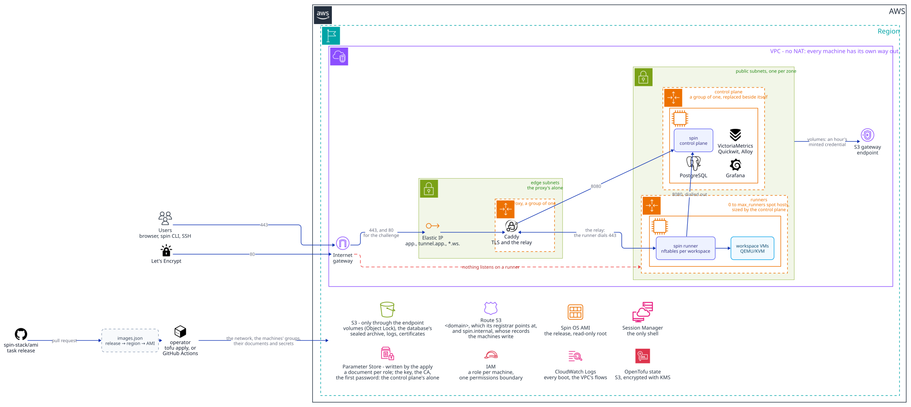

# spin on AWS

A [spin](https://github.com/spin-stack/spin) installation on AWS, as one module:



```hcl
module "spin" {
  source       = "github.com/spin-stack/spin-terraform-aws?ref=<tag>"
  spin_version = "v20260921.02"
  domain       = "example.com"
}
```

Every machine boots **Spin OS** of that release: the image
[spin-stack/ami](https://github.com/spin-stack/ami) builds and publishes. Where each release's
image is, region by region, is [`images.json`](images.json) - `{ "<release>": { "<region>":
"<ami-id>" } }` - which the ami repository's publish updates here by a pull request. A module ref
is then a set of releases with their images: a release with none in the installation's region is
refused at plan, naming the regions it has one in, and `image_id` names an image of your own
build instead.

The root composes two modules, and each can be used on its own
(`github.com/spin-stack/spin-terraform-aws//modules/controlplane?ref=<tag>`) where the root does
not expose what an installation needs to decide:

- **`modules/controlplane`** - the VPC, the buckets, the database's archive, the control plane's
  machine, the proxy's on its own, the installation's CA and secrets, and the document each
  machine starts on.
- **`modules/runners`** - an autoscaling group of runners that join by themselves, spot by
  default, that the control plane sizes: none until a workspace waits for a host, and none again
  once nothing has run for `runner_idle_minutes` (at once in the `quiet_hours`). It takes the
  control plane module's outputs whole, its name among them.

A variable of the root left unset is the module's own default: each defaults to null, which
the modules read as their default, so a default is said once. `examples/complete` is an
installation, `examples/minimal` the least one is (a release and a domain), and each module's
inputs and outputs are in its own README. `task lint` validates both examples, lints with TFLint,
scans with Trivy - each finding this installation decides against is ignored at its resource, with
the reason - checks those READMEs against the code (`task docs` writes them), and runs each
module's tests against its plan.

## Before you start

- [OpenTofu](https://opentofu.org/docs/intro/install/) 1.11 or newer, the
  [AWS CLI](https://docs.aws.amazon.com/cli/latest/userguide/getting-started-install.html) signed
  in to the account (`aws sts get-caller-identity` answers), and the
  [Session Manager plugin](https://docs.aws.amazon.com/systems-manager/latest/userguide/session-manager-working-with-install-plugin.html)
  for a shell on a machine.
- A domain, or a subdomain of one, that is the installation's alone: its zone is made here, in
  Route 53 ($0.50 a month), and whoever registered it points its nameservers at the
  `name_servers` output.
- Room for runners. Each is a spot machine of 32 or 48 vCPUs, from five types of one generation
  (`runner_instance_types`), and a new account's spot vCPU quota may be lower than one of them
  (Service Quotas → EC2 → "All Standard Spot Instance Requests"). How likely spot is to give and
  keep one in the region you chose, from 1 to 10 - below 7, name more types or use on-demand
  (`runner_spot = false`):

  ```bash
  aws ec2 get-spot-placement-scores --target-capacity 1 --region-names <region> \
    --instance-types m8id.8xlarge c8id.8xlarge r8id.8xlarge m8id.12xlarge c8id.12xlarge
  ```

## Installing

Once per account and region, a bucket and a KMS key for OpenTofu's state (the state holds the
installation's CA key, so it is encrypted and never a file on your machine):

```bash
cd bootstrap
tofu init && tofu apply
```

Then the installation. `examples/complete` is one; copy it anywhere, or use it as it is:

```bash
cd ../examples/complete
cp terraform.tfvars.example terraform.tfvars    # and fill it in
$(tofu -chdir=../../bootstrap output -raw init)
tofu apply
tofu output -raw next_steps
```

`next_steps` says the rest, in order: the DNS records, how to tell the installation is up (about
ten minutes the first time) and where to look if it is not, and the first sign-in - `admin@<domain>`
(`admin_email`) with a one-time password this apply wrote to SSM.

## Updating

Move the module's ref to a commit whose `images.json` has the new release in the installation's
region, change `spin_version` in `terraform.tfvars` to it, then:

```bash
tofu plan     # the image, the launch templates and the documents change, and nothing else
tofu apply
```

For the installations spin-stack runs, that edit is a pull request nobody writes, and every step
of it is a workflow run, with its log: spin-stack/shipset, which coordinates them, dispatches
spin-stack/ami's release workflow for each spin release, which builds and publishes its image and
opens the pull request that adds it to `images.json` here; shipset merges that once its checks
pass, and dispatches `.github/workflows/propose.yml` for each deployment its `shipset.yaml` names,
which opens - or rewrites - the pull request there that moves both. A person merges that, and
applies.

The control plane and the proxy are each replaced beside themselves, and the old one serves until
the new one does. How it went is `tofu output update_status`: `Successful`; or
`RollbackSuccessful` with the reason, in which case the old machine is still serving and
`tofu output boot_log` - one command per role, since a role's machines are one stream prefix - says
why the new one did not come up. A change to anything else a machine starts on -
`installation_config`, the autoscaling settings - rolls out the same way.

A runner cannot take a release in place either - its root is read-only and verified - and how it
gets one is `runner_rollout`. `idle`, the default, moves no workspace for it: the control plane
empties the group once nothing runs, starts or is still being saved to the bucket, and the next
host it starts boots the new release; until then a host keeps the old one, which its control plane
serves for 90 days (spin's `compat.Window`). `rolling` is for a fleet that never empties: the hosts
are replaced at once, one at a time with the new one first, each old one leaving by its drain - its
workspaces suspended to the bucket and resumed on another host.

A release older than the one that last started the database refuses to start on it: going back
past a change to the schema is a restore of the database from its archive to a point before it,
not an update.

## Operating it

What drain, activate and revoke do to a runner, and how to undo each, is spin's
`docs/runners.md`. What is AWS's is replacing a runner's machine - after a revoke, or when one is
wedged: terminate its instance in the group without lowering the group's size, and the group starts
another, which joins by its role as a new host.

```bash
aws autoscaling describe-auto-scaling-instances \
  --query 'AutoScalingInstances[?AutoScalingGroupName==`<name>-runners`].[InstanceId,LifecycleState,HealthStatus]' --output table
aws autoscaling terminate-instance-in-auto-scaling-group --instance-id <i-...> --no-should-decrement-desired-capacity
```

Drain it first if it still runs workspaces you want kept. With nothing waiting for a host the
control plane may have sized the group to zero already, and then there is nothing to replace: the
next workspace that waits starts one.

## Several installations in one account

An account holds as many installations as it has names and regions for: two of different names in
one region, and two of one name in two regions. `name` is what tells them apart within a region -
every regional name is under it: the buckets (`<name>-volumes-<account>-<region>`), the groups,
the security groups, and the parameters and log groups under `/spin/<name>/`. IAM is the account's
and not a region's, so what it names carries the region too (`<name>-<region>-controlplane`), and so
does the audience a runner signs its join for.

One name in one region is one installation. The name is claimed before anything is made under it
(`/spin/<name>/claim`): a second installation of that name in that region stops at the claim, with
nothing of it made. A name is 2 to 26 characters, which keeps the longest bucket name within S3's
63.

What the account has once, the installations share: the Spin OS image of a release (read, never
changed, by each), and the EC2 vCPU quota of a region, which each installation's `request_quota`
checks against its own runners alone - where several share a region, leave it to one of them.

## Removing an installation

An installation keeps its data past a plain `tofu destroy`: the volumes, the database's archive
and the logs are in buckets a destroy does not empty, and every bucket refuses object writes and
deletes from outside the VPC - the root account's included, so they cannot be emptied from a
laptop either. Removing one is said first, applied, and only then destroyed:

1. Set `decommission = true` on the module and apply. Nothing but the buckets changes: their
   VPC-only policies go, and each is marked to be emptied by a destroy - every version, legal
   holds lifted, the GOVERNANCE retention bypassed.

   ```bash
   tofu apply   # with decommission = true in module "spin"
   ```

2. The encryption key and the CA refuse to be destroyed, because an apply that replaced either
   would leave an installation nothing can open. Take them out of the state, destroy, and delete
   the key's parameter:

   ```bash
   tofu state rm module.spin.module.controlplane.aws_ssm_parameter.encryption_key \
     module.spin.module.controlplane.tls_private_key.ca module.spin.module.controlplane.tls_self_signed_cert.ca
   tofu destroy
   aws ssm delete-parameter --name /spin/<name>/controlplane-encryption-key
   ```

The apply has to come first: a destroy empties a bucket as its state says, so `decommission`
set only on the destroy changes nothing - it stops with `BucketNotEmpty`. A destroy that already
stopped takes the same apply, limited to the buckets and policies the state still has: a bucket
named that the destroy already removed would be made again. Its plan is those buckets'
`force_destroy` turned on and their policies removed, and nothing else:

```bash
tofu apply $(tofu state list | grep -E '\.aws_s3_bucket(_policy)?\.[a-z]+(\[0\])?$' | sed 's/^/-target=/')
tofu destroy
```

The installation's state bucket and key (`bootstrap/`) are removed apart, after this.

## What it decides, and why

- **A machine is its release's image, and is told its role and where its document is.** Every
  machine boots Spin OS of `spin_version`: a read-only root the kernel checks every block of, into
  which spin laid what its `release.yml` signed, checked against the signature when the image was
  built. A machine fetches nothing. Its user data is two systemd credentials - its role and the
  SSM parameter its document is in - which systemd-imds imports and nothing runs. Everything else -
  where the database's archive is, the name it takes, the collector - is in that document, and every step is
  `spin-boot`'s, in Go with tests (spin's `internal/installation/boot`); a document naming another
  release than the image's is refused. Nothing is a container: each role is a binary under systemd,
  as its own user.
- **This apply writes every parameter, and no machine writes one.** The documents, the
  installation's configuration, the CA, the encryption key and the first administrator's
  password are all this module's; the permissions boundary denies every role of the
  installation `ssm:PutParameter`. A machine that was taken cannot leave a value for the next
  one to start on.
- **The encryption key and the first password never reach the state.** Both are ephemeral values
  written through write-only attributes, once (`value_wo_version`). The key is, with the
  database, the installation: a new one is a database nothing can open, so nothing here makes one
  again. The CA is in the state on purpose - its certificate is in the proxy's and the runners'
  documents - so **encrypt the state** (OpenTofu's `encryption` block; a KMS key is the simplest).
- **Runners join by who they are.** A runner signs a GetCallerIdentity with its instance role,
  bound to this installation and to its host id, and the control plane asks STS whose signature
  it is (spin's `internal/domain/hostjoin`). The installation's configuration names the runners'
  role and the policy its machines start under (`runner_policy`: a spot reclaim announced by
  AWS and 100 seconds to empty itself). There is no token to mint, rotate or publish, and the
  runners' role reads its own document and nothing else.
- **A runner runs its image's release**, and nothing else: its machine fetches nothing and hands
  over to no other `spin-boot`. Whether the control plane serves a runner of that release is the
  control plane's to say when the runner registers (spin's `internal/controlplane/compat`: a
  host no older than the compatibility window, and none newer than itself), so while an update
  replaces the control plane - or after one is abandoned - the old one may go on serving the
  runners it can. A runner of another release is a runner of another image.
- **No NAT gateway, no interface endpoints.** Every machine has a public address in a public
  subnet, and the bucket is reached through the S3 gateway endpoint, which is free. A NAT is
  $32 a month and a charge per GB before a workspace runs; an interface endpoint is $7 a
  month per zone each. A public address is not an open door: each machine's security group is
  what the internet may reach of it, and for all but one of them that is nothing.
- **The proxy is the only machine the internet reaches**, on 80 and 443, and it holds nothing
  but its own certificates and the CA certificate it trusts the control plane by. The control
  plane has no rule for the internet at all - its public address is a way out - and its 8080
  answers the proxy and the runners alone; the proxy may reach the control plane on 8080 and the
  web on 80 and 443, and nothing else. A runner has no ingress. None of them has SSH: Session
  Manager is the way in, and IMDSv2 is required everywhere.
- **Inside the VPC the components are names.** A private zone, `internal_zone`
  (`spin.internal`, $0.50 a month), holds `cp.` and `proxy.` with a ten-second TTL, each
  written by the machine it names: the control plane's certificate carries `cp.spin.internal`,
  and the proxy, the runners and the collector's clients dial it, so a machine replaced is a
  record changed rather than an address in every runner's configuration. The runners reach the
  relay at `proxy.spin.internal` too, checking its certificate as `tunnel.app.<domain>`, so the
  relay never leaves the VPC and the proxy's 443 need not be open to wherever runners happen to
  be: `proxy_allowed_cidrs` can be the users' networks alone (80 stays open for the ACME
  challenge). The domain's public zone is the installation's too, and `app.`, `tunnel.app.` and
  `*.ws.` in it point at the proxy's elastic IP: the workspaces under a name of their own, so
  none is a subdomain of the dashboard's.
- **An update is a machine beside the old one, not a stop.** The control plane and the proxy
  are each an autoscaling group of one, and a change to what a machine is - `spin_version`, the
  image, the size - is a new launch template the group's instance refresh rolls out at 100%
  healthy: the new machine starts before the old one is retired, and a launch hook holds the
  refresh until it says it serves, abandoning it - and keeping the old - if it never does. A new
  control plane points `cp.` at itself and starts, which takes the term: the old one,
  superseded, closes and stays down, and runners and the proxy reconnect within seconds while
  every workspace runs on. A new control plane that fails before it is in service hands the
  installation back: its control plane stopped, `cp.` pointed where it was, the launch
  abandoned. Each control plane machine then runs `spin-boot watch`, which keeps its control
  plane to whose the name is - serving it when the name is its own, which is how the old one
  takes the term back; taking the name back when the machine it points at has answered nothing
  for fifteen minutes; asking to be replaced when it cannot serve for ten. A new proxy puts back
  the certificates the last one had from their own bucket (versioned, no Object Lock), starts
  Caddy, and once Caddy answers points `proxy.` at itself and takes the elastic IP; its watch
  saves what Caddy issues every five minutes, following no link out of Caddy's directory. What
  is lost is seconds of API and open connections, never a workspace. The image is the release's
  Spin OS, the id `images.json` names, so it moves only with `spin_version`, the module's ref, or
  `image_id`: an image published again for a release reaches an installation by a reviewed change
  to that file and by nothing else. A change to a
  document alone reaches a machine when it next starts: `aws autoscaling
  start-instance-refresh` on its group.
- **The proxy has subnets of its own**, and the control plane takes a browser's address only
  from them (`trusted_proxies`, declared in the installation's configuration): a runner,
  elsewhere in the VPC, cannot pass as the proxy.
- **No role can make itself more.** Every role both modules create carries one permissions
  boundary: none may write IAM or pass a role, assume any role but the runner scope, touch the
  VPC's network or a security group, write a parameter, run commands on another machine through
  SSM, or lift the bucket's lock or the logs; and none but the control plane's reaches the
  database's archive. A policy attached later, by mistake or from a
  machine that was taken, cannot grant past it.
- **The control plane's secrets are its role's alone.** Session Manager is given as a policy of
  this module's - the agent's registration and its channels - and not AWS's
  `AmazonSSMManagedInstanceCore`, which also reads every parameter in the account: the
  parameters are under the account's `aws/ssm` key, so on the proxy or a runner it opened the
  encryption key. The boundary backs this: no role but the control plane's reads the key, the
  CA's key, the first password or the installation's configuration.
- **What crossed the network is kept.** The VPC's flow log goes to CloudWatch for
  `log_retention_days` (30); `flow_logs = false` turns it off. The resolver's query log is
  Route 53 Resolver's, and `dns_query_logs = true` asks for it.
- **Telemetry, kept by the installation itself.** Grafana Alloy on the control plane's machine is
  the one collector, pinned by `collector` (the package and its SHA-256): the control plane, the
  proxy and every runner push OTLP to it on 4317, which only they may reach. It keeps what it is
  given in the stores beside it, on the same machine and on loopback only: logs and traces in
  Quickwit and metrics in VictoriaMetrics, both over the logs bucket - Quickwit's indexes and
  metastore, and the metric store's backups under `metrics/`, taken every quarter of an hour and
  as the machine stops, so a machine a release replaces takes nothing with it. Nothing leaves the
  installation, and there is no backend's token to hold. Grafana over the metric store is served
  to administrators alone, inside the dashboard (Observe → Metrics), signed in by a token the
  control plane signs. Each store is a systemd unit of its own user, started only while the
  control plane beside it leads. Which traces and metrics are kept is the dashboard's (Admin →
  Settings → Telemetry): every trace that failed anywhere, every one slower than a threshold, a
  percent of the rest, and the metrics dropped by name; Alloy reads it every thirty seconds and
  decides at the end of each trace. The same page shows what the collector kept and failed to
  over its last minute. Metrics are pushed every 60 seconds, a point a minute per series.
- **Each promise is a test.** `tofu test` in each module plans it with no account and asserts
  the above - the user data, the documents, the secrets, the ingress rules, IMDSv2, encryption,
  the bucket's lock and policy, the roles and their boundary - and `task lint` runs it with the
  format check and validation, in CI on every push.
- **The bucket answers object requests only through that endpoint.** A runner's credential is
  minted by the control plane for an hour and scoped to its volumes; copied off the machine,
  it opens nothing. Bucket-level calls stay open to the account, so this module can still be
  applied from outside the VPC.
- **The control plane's role cannot lift the lock.** It may not bypass a retention, rewrite
  the bucket's policy or change its Object Lock rule. Spin writes the bucket's lifecycle rules
  itself, so this module declares none.
- **The control plane sizes the group, not a schedule or a metric.** It is the one that knows a
  workspace is waiting for a host, and that the last one stopped an hour ago. The first create
  or start of the day waits in *Waiting for a host* for the few minutes a runner takes to boot
  and install; the control plane has asked the group for one, and places the workspace on it
  when it registers. It only ever goes from none to one, adds one while a workspace has waited
  longer than a host takes to come, and goes back to none: it never picks one host of several
  to take away, since the group would choose which. Its role may resize that one group and
  nothing else, and the group's name, `<name>-runners`, is the contract between the modules.
- **The installation's configuration is this module's.** `installation_config` is the
  installation's config file (spin's `configs/spin-example.yaml`); this module adds the domain,
  who joins as a host and the autoscaling settings, and writes it where the control plane reads
  it at every start. It is then the file's one author.
- **A scale-in is a drain.** The group's termination hook holds a host for `drain_seconds`; the
  runner reads the lifecycle state from the metadata service and suspends its workspaces to
  the bucket, where they resume on the next host. A spot reclaim is the same with a two-minute
  notice, and capacity rebalancing starts the replacement first.
- **The database is the control plane's, on its machine, and outlives it through its archive.**
  No managed database: PostgreSQL runs beside the control plane from binaries the release
  carries, and nothing else opens it, so there is no port of it in any security group and no
  password of it anywhere. Every release replaces that machine and its disk, so the control plane
  ships a base backup and every WAL segment as it is written to a bucket of its own,
  `<name>-database-<account>-<region>` (the `database_bucket` output), sealed under the
  installation's key before it leaves the machine; the machine that replaces it restores from
  there before it serves. The bucket is versioned under a GOVERNANCE Object Lock of fourteen
  days, as spin requires of every store it opens, and what a delete or an overwrite left goes a
  day after the lock lets it. Only the control plane's role reaches it - list, read, write and
  delete, read its versioning and its lock, and no version - and the boundary refuses it to every other role and refuses every role the erasing of
  a version. It is never the volumes' bucket, whose credentials hosts hold, and where it is is in
  the control plane's document, since the database cannot say where its own backup is.
- **Small machines.** The proxy is `t8i.micro` and the control plane `t8i.medium` by default:
  the control plane's machine holds the control plane, its database, Alloy and the stores of logs,
  traces and metrics it runs. Two of them are the whole standing cost when no runner is up.

Hosts outside the group are still added the ordinary way - a one-time token from Admin → Hosts
and `spin-install runner` - and are policed by the same control plane.
